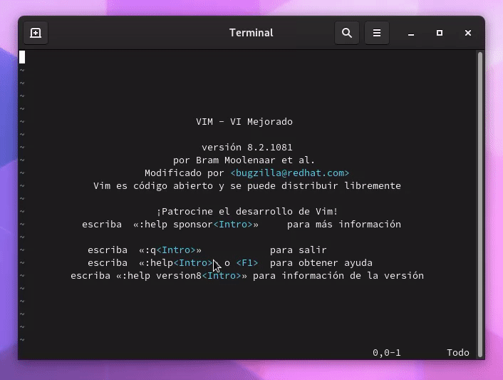
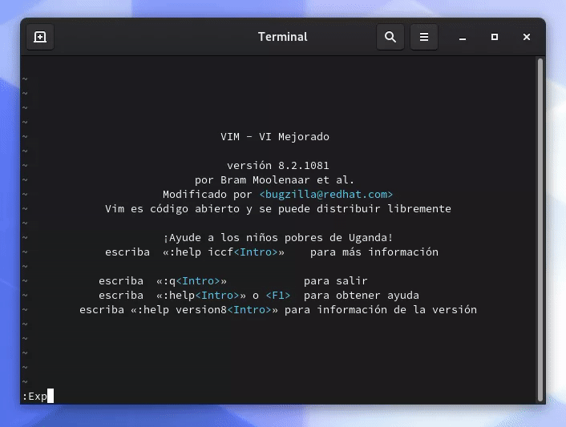
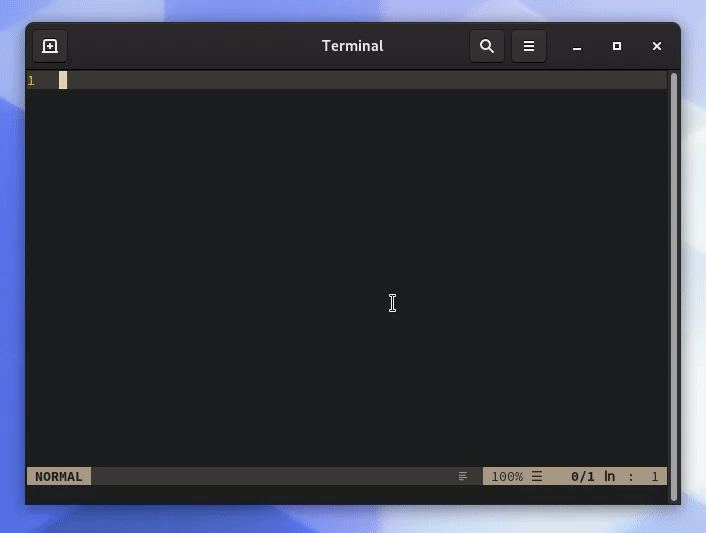
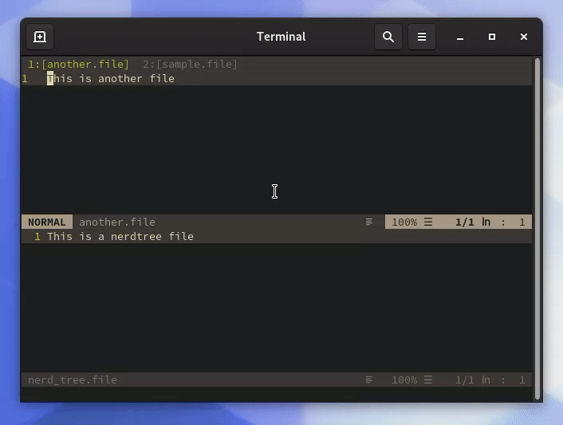
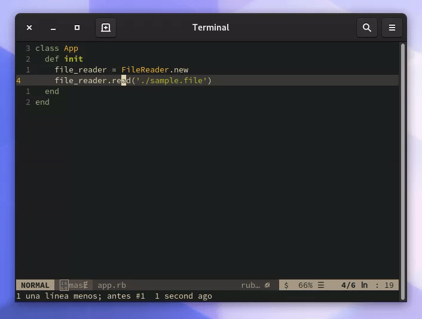

# Vim: A sense of project

## Introduction
Vim (or [Neovim](https://neovim.io/)) is an eminent text editor, it is
lightweight, ubiquitous and customizable in its core, but those are secondary
traits, what makes Vim shine are fast writing capabilities with powerful
keyboard centered composable commands.

Despite its benefits, there is a large list of things of Vim can't do like:
- Advanced file management
- GIT integration
- Code completion
- Code linting
- Pairing sessions
- Global search and replace

All of those are indispensable tools for everyday development; but is this
true? Not at all, and I'll show how can you create a better Vim setup so you
can access the tools that you value the most and without losing the power of
Vim.

## Disclaimer
This is not a total beginners guide to Vim, if you have previously configured
Vim then you are good to go.

## Body
Vim built-in customizability allows the community to create plugins for it,
and [VimAwesome](https://vimawesome.com/) is the Hub for almost all public
plugins available, check it out, as its name suggest, is awesome (you can
navigate with the Vim keys).

Adding plugins to Vim is straightforward:
 1. Download it
 1. Add it on your config file (.vimrc or init.vim) by sourcing it
 1. Source again your config file or close/open Vim
 1. Enjoy!

Even if is not hard to do it, is tedious, so what I recommend to you is to use
a Plugin manager like [Plug](https://github.com/junegunn/vim-plug) or
[Vundle](https://github.com/VundleVim/Vundle.vim), I recommend Plug because is
the one I have used.

### File management

#### netrw
Vim comes out of the box with a file explorer named **netrw**, to use it you
can enter `Exp` or `Explorer` on the normal mode. Then navigate with the usual
keys, open a file and to get back to the explorer with `Rex`



It seems that you can't create new files or directories from it. That's because
is a obscure tool to use at first, use `:help Explore` or press `F1`
at the explore screen to see the full list of commands.

For example to create a new file use the `%` to create a new file in the
current directory



You can sort the explorer entries, open it on split or another tab, hide 
dot-files, show/hide with custom filters, create bookmarks, execute arbitrary
commands to marked files, etc.

#### NERDTree
If you happen to love the way trees present your project's files you may
be better with the [NERDTree](https://vimawesome.com/plugin/nerdtree-red)
plugin, a powerful tool for file management.

NERDTree allows a lot of plugins to enhance its capabilities, I'll show you a
few of them later on.


You can create a shortcut to fast toggle the NERDTree, in your config file:

```vim
" By default your leader is the \ key
nnoremap <leader>f :NERDTreeToggle<CR>
```

Also you can see the plugin documentation pressing `?` when its open.

#### FZF
And what about search for files by its name or contents? Here comes
[FZF](https://vimawesome.com/plugin/fzf), it allows to use the FZF tool
for fuzzy file searching, an on top of that allows to use any other searcher
that like git grep, ripgrep or the silversearcher (I use the ripgrep tool).


 You can create a shortcut the same as the well-known **ctrlp**
finder, for it you need to map the FZF plugin to the ctrl-p shortcut (and/or
configure FZF to use ripgrep as its default command):

```vim
noremap <c-p> :FZF<CR>

" Fuzzy finder configuration to use the ripgrep tool
let $FZF_DEFAULT_COMMAND = 'rg --files --hidden'
```

You can use the `Rg` tool to search file contents. 



You can map that command to ctrl-s:
```vim
noremap <c-s> :Rg<CR>
```

### Project-wide search and replace

### Project workspace
You close Vim and call it a day, next morning when you open the editor you
probably have forgotten which files you were working on and how you arranged
them. Well you don't have to go through that hassle no more, Vim have sessions
that allow you to save your workplace as you leaved the last time.

In normal mode enter `:mksession` to create a new session file in your working
directory called `Session.vim`, if you want to open Vim with that specific
session only open Vim with the `-S` flag and you are set.



The downside of using sessions is that you have to override them every time you
have to change your workspace layout or open files, to overcome this issue, you
can use [Obsession](https://vimawesome.com/plugin/obsession-vim) to manage all
session related stuff for you.

Remember to always start Vim with `vim -S` to use your `Session.vim` file.

### Code Completion
By default Vim can complete based on dictionaries, opened buffers and tags
files, this can fall short compared to other text editors.

Also, this is a controversial subjects for Vim users, there is not an
unanimous verdict on what a completion tool should or shouldn't do, I'll list
a couple of plugins for code completion:

  - [COC](https://vimawesome.com/plugin/coc-nvim) has support
  for a lot of languages, function signature completion and a handful of
  extensions.
  - [youcompleteme](https://vimawesome.com/plugin/youcompleteme) has a lot of
  search engines for different languages.
  - [Supertab](https://vimawesome.com/plugin/supertab) allows you to use the
  complete tool using the `tab` key.

### Code linters
There are a bunch of useful plugins for code linting, but the following two are
my picks:

  - [Ale](https://vimawesome.com/plugin/ale)
  - [Neomake](https://vimawesome.com/plugin/neomake-impatience-and-laziness)

Whichever you want to use will work perfect, both are cool (I use Neomake).

### Code navigation
If you want to go directly to a function declaration, Vim has built-in support
for it. Vim takes advantage of the `tags` file, you need a tool to generate
that file. The downside of it is that you have to update that file every time
you made a significant change on your codebase, to avoid that boring process,
use [Gutentags](https://vimawesome.com/plugin/vim-gutentags), handles all the
tags related tasks.

To go to a code declaration position the cursor on the specific method or class
name and use `ctrl + ]`, if there's a tags file with that definition it will
move you directly to its declaration.



### Pairing sessions
Vim by itself doesn't have remote pairing capabilities, but it can be achieved
with [tmate](https://tmate.io) for fast SSH session creation with read-only
capabilities (uses your Tmux configuration if you already have it).

### GIT integration
Since in Vim you can execute arbitrary commands you can communicate with GIT,
but that is not that fun, there are a couple of plugins to enhance the
GIT capabilities inside Vim:

  - [NERDTree Git Plugin](https://vimawesome.com/plugin/nerdtree-git-plugin)
  shows visual elements to your NERDTree so you know that something is going on
  with them
  - [Vim Gutter](https://vimawesome.com/plugin/vim-gitgutter) uses the status
  column to show new, edited and deleted lines in your open buffers, show
  differences, etc.
  - [Fugitive](https://vimawesome.com/plugin/fugitive-vim) to call any GIT
  command inside VIm, with amazing diff, log and blame capabilities.

### Spelling and Dictionary
Vim has built-in capabilities for spell checking highlighting and correction,
to enable them in normal mode enter `:set spell spelllang=en_us`.


Vim also has built-in Dictionary completion, to use it, your system should have
a **words** file, in Linux by default there's a dictionary file at
`/usr/share/dict/words` (you can download them), in normal mode enter
`:set dictionary+=/usr/share/dict/words` to append it to existing dictionaries


Use `ctrl + x` and `ctrl + k` to open the completion modal, use the `ctrl + p`
and `ctrl + n` shortcuts to navigate it.

### Large file editing
Vim tend to choke when you open large files due to all the line
numeration, syntax highlighting and all the plugins working on that specific
file, for it you can disable most of them before opening the file, or, use the
[LargeFile](https://vimawesome.com/plugin/largefile) to do it for you.

## Conclusion
<!-- Were those solutions enough? -->
<!--
  Are all issues addressed?
  If not What makes Vim good even without those things?
  Further research and other helpful plugins
-->
  - [10 Vim plugins for Writers](https://tomfern.com/posts/vim-for-writers)
  - [Vim: you don't need NERDTree or (maybe) netrw](https://shapeshed.com/vim-netrw/)
